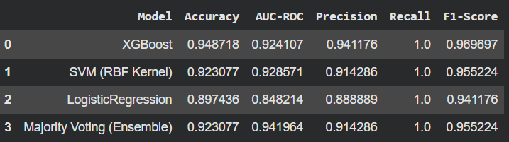
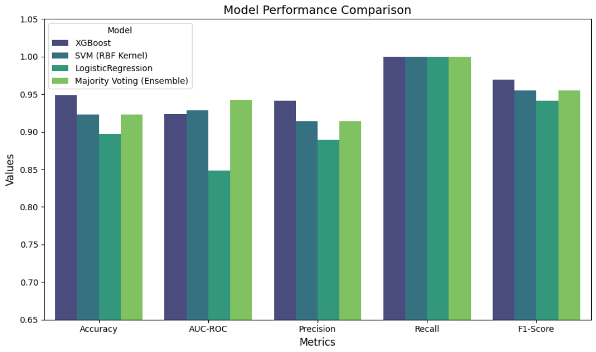

# 🧠 Parkinson’s Disease Detection using Machine Learning

## 1. Problem Statement
Parkinson’s Disease (PD) is a progressive neurological disorder that affects movement and speech. Early detection is crucial for timely treatment and better patient outcomes. Traditional diagnosis requires clinical expertise and can be time-consuming.

This project aims to build a machine learning model to detect Parkinson’s Disease using biomedical voice measurements.

---

## 2. Dataset Description
The dataset consists of multiple biomedical voice measurements extracted from voice recordings of individuals.

- Each row represents a voice recording
- Features include:
  - **Frequency measures** (Fo, Fhi, Flo)
  - **Jitter & Shimmer** (voice stability)
  - **Noise measures** (NHR, HNR)
  - **Nonlinear features** (RPDE, DFA, PPE, etc.)
- **Target Variable:**
  - `status = 1` → Parkinson’s Disease
  - `status = 0` → Healthy

---

## 3. Objective
- Build a classification model to detect Parkinson’s Disease
- Compare multiple machine learning algorithms
- Evaluate performance using relevant metrics
- Identify the most important voice features contributing to prediction

---

## 4. Proposed Solution

### 4.a Methodology
- Data Cleaning & Preprocessing  
  - Removed special characters from column names  
  - Handled multicollinearity using correlation threshold  

- Exploratory Data Analysis (EDA)  
  - Correlation analysis  
  - Feature distribution comparison  

- Model Training  
  - Logistic Regression  
  - Support Vector Machine (RBF Kernel)  
  - XGBoost Classifier  

- Model Evaluation  
  - Accuracy  
  - Precision  
  - Recall  
  - F1-Score  
  - AUC-ROC  
  - Cross-validation  

- Ensemble Learning  
  - Voting Classifier (Soft Voting) to improve performance  

- Visualization  
  - Bar plots for metric comparison  
  - Learning curves  
  - Radar (Spider) chart for multi-metric comparison  

---

### 4.b Results / Evaluation Metrics

📊 Model performance comparison:

📊 Model performance visualization:

---

## 5. Conclusion
- Among all models, **XGBoost / Ensemble model** achieved the best performance based on F1-Score and AUC-ROC.
- Ensemble learning improved overall prediction stability by combining multiple models.
- Features related to **jitter, shimmer, and nonlinear dynamics** played a significant role in detecting Parkinson’s Disease.
- The model demonstrates the potential of using voice data for early-stage PD detection.

---

## 🚀 Future Scope
- Deploy as a web application for real-time prediction  
- Integrate live voice input using audio processing libraries  
- Apply explainability techniques like SHAP for better interpretability  
- Validate model performance with real clinical datasets  

---

## ⚠️ Limitations
- Dataset size is relatively small  
- Not a substitute for clinical diagnosis  
- Requires real-world validation  

---
